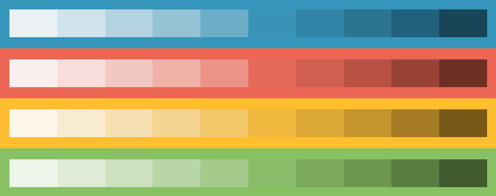

## Tonality

[](https://badge.fury.io/js/tonality)
[](https://david-dm.org/souporserious/tonality)
[](https://github.com/prettier/prettier)

Some small functions to help build and adjust color tone palettes.



## Install

`yarn add tonality`

`npm install tonality --save`

```html
<script src="https://unpkg.com/purpose/dist/tonality.js"></script>
(UMD library exposed as `Tonality`)
```

## Example Usage

```js
import {
  createTone,
  createTones,
  createColorScale,
  createColorScales,
  flattenColorScales,
  getLightness,
} from '../src/index'

const colors = {
  info: '#3595bb',
  danger: '#eb6654',
  warning: '#ffbe30',
  success: '#88c163',
  grey: '#9fa3a7',
}
const colorScales = createColorScales(colors)
const flatColorScales = flattenColorScales(colorScales)
const successTone = createTone(colors.success)

successTone(0) // darkest shade
successTone(0.5) // medium shade
successTone(1) // lightest shade
```

## Running Locally

clone repo

`git clone git@github.com:souporserious/tonality.git`

move into folder

`cd ~/tonality`

install dependencies

`yarn`

run dev mode

`yarn dev`

open your browser and visit: `http://localhost:8080/`

## Thank You
[This article](https://medium.com/@erikdkennedy/color-in-ui-design-a-practical-framework-e18cacd97f9e) sparked my inspiration for these helpers. Thank you @erikdkennedy!

The code behind this idea was heavily inspired by the [Monochrome](https://monochrome.jxnblk.com/0077d6) app. Thank you @jxnblk!
